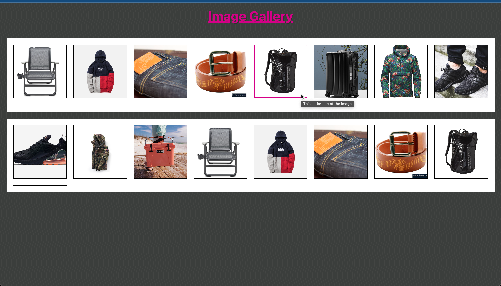
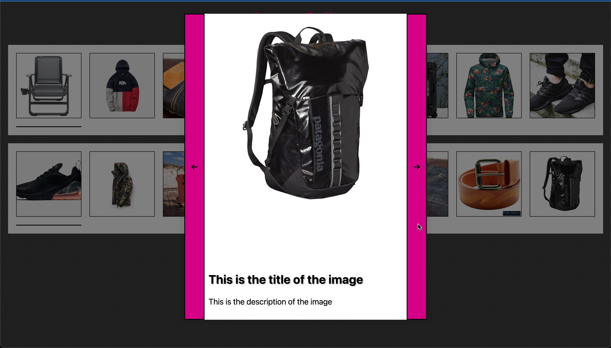
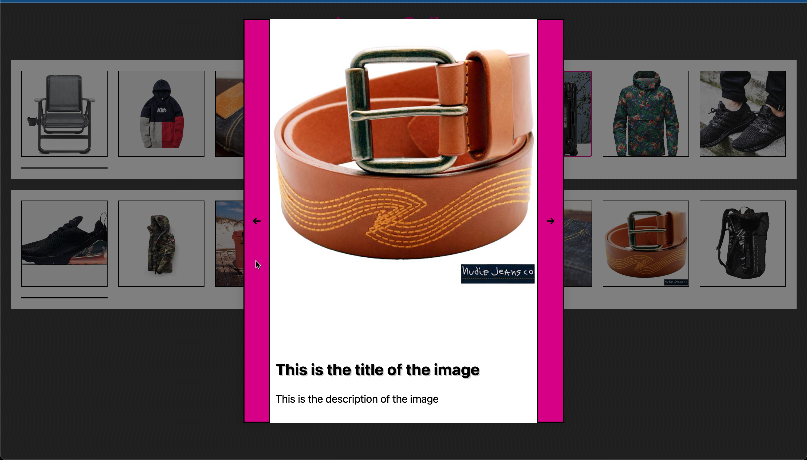

# image-gallery 
An Image Gallery that opens and closes images on a modal, switches between photos with buttons and keys, and other functionalities.

## Images & Functionalities

- Click on an image or press 'Tab' and 'Enter' to navigate to the image you want to open.
- Click outside the modal or the 'Esc' button to close the modal.
- Use "ArrowLeft" and "ArrowRight" buttons to navigate between images.

### Images



---
</br>




## Steps to get it working

1. Clone Repo/Download files.
2. (Download &)Run npm install on the terminal.
3. Run ```parcel filename.html```
4. Or Open the file on a browser(local).
